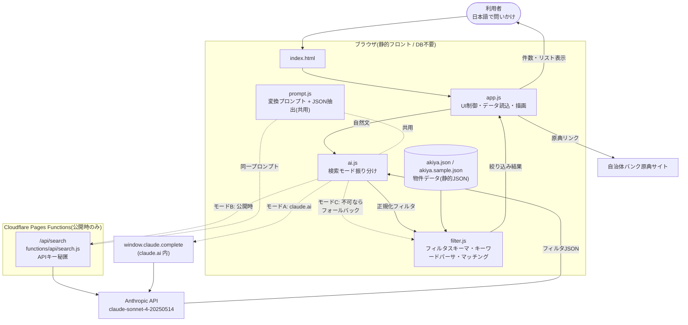
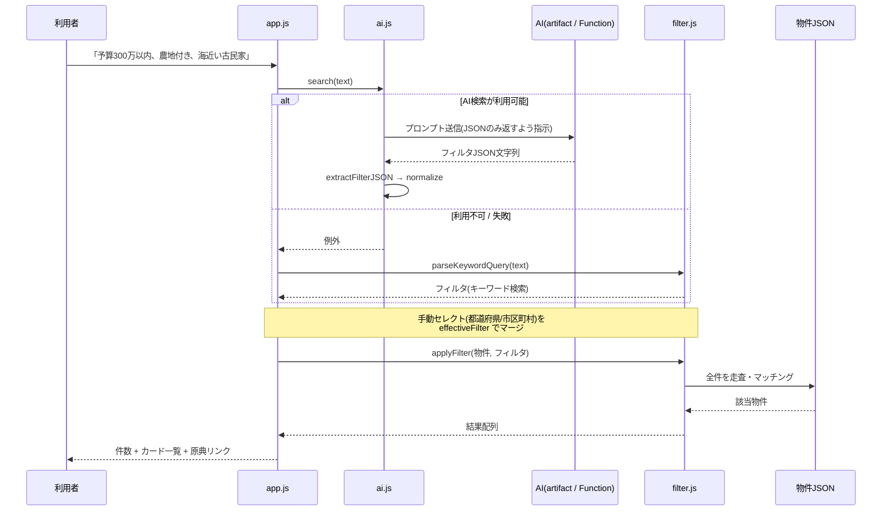
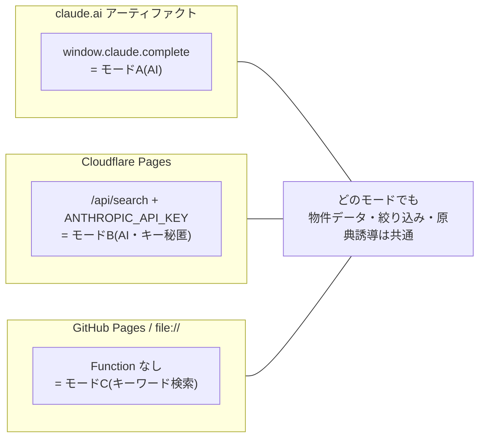
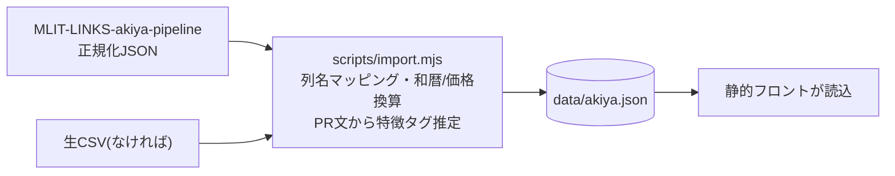

# アーキテクチャ図解

## 1. 全体構成(コンポーネントとデータの流れ)

```mermaid
flowchart TB
    user(["利用者<br/>日本語で問いかけ"])

    subgraph browser["ブラウザ(静的フロント / DB不要)"]
        idx["index.html"]
        app["app.js<br/>UI制御・データ読込・描画"]
        ai["ai.js<br/>検索モード振り分け"]
        prompt["prompt.js<br/>変換プロンプト + JSON抽出(共用)"]
        filter["filter.js<br/>フィルタスキーマ・キーワードパーサ・マッチング"]
        data[("akiya.json / akiya.sample.json<br/>物件データ(静的JSON)")]
    end

    subgraph edge["Cloudflare Pages Functions(公開時のみ)"]
        fn["/api/search<br/>functions/api/search.js<br/>APIキー秘匿"]
    end

    anthropic["Anthropic API<br/>claude-sonnet-4-20250514"]
    artifact["window.claude.complete<br/>(claude.ai 内)"]
    source["自治体バンク原典サイト"]

    user --> idx --> app
    app -->|自然文| ai
    ai -.->|モードA: claude.ai| artifact
    ai -.->|モードB: 公開時| fn --> anthropic
    artifact --> anthropic
    ai -.->|モードC: 不可なら<br/>フォールバック| filter
    prompt -.共用.- ai
    prompt -.同一プロンプト.- fn

    anthropic -->|フィルタJSON| ai
    ai -->|正規化フィルタ| filter
    data --> filter
    filter -->|絞り込み結果| app
    app -->|件数・リスト表示| user
    app -->|原典リンク| source
```

## 2. 検索1回の処理シーケンス(二系統 + フォールバック)

```mermaid
sequenceDiagram
    participant U as 利用者
    participant App as app.js
    participant AI as ai.js
    participant Src as AI(artifact / Function)
    participant F as filter.js
    participant D as 物件JSON

    U->>App: 「予算300万以内、農地付き、海近い古民家」
    App->>AI: search(text)
    alt AI検索が利用可能
        AI->>Src: プロンプト送信(JSONのみ返すよう指示)
        Src-->>AI: フィルタJSON文字列
        AI->>AI: extractFilterJSON → normalize
    else 利用不可 / 失敗
        AI-->>App: 例外
        App->>F: parseKeywordQuery(text)
        F-->>App: フィルタ(キーワード検索)
    end
    Note over App,F: 手動セレクト(都道府県/市区町村)を<br/>effectiveFilter でマージ
    App->>F: applyFilter(物件, フィルタ)
    F->>D: 全件を走査・マッチング
    D-->>F: 該当物件
    F-->>App: 結果配列
    App-->>U: 件数 + カード一覧 + 原典リンク
```

## 3. デプロイ別の検索モード

```mermaid
flowchart LR
    subgraph A["claude.ai アーティファクト"]
        a1["window.claude.complete<br/>= モードA(AI)"]
    end
    subgraph B["Cloudflare Pages"]
        b1["/api/search + ANTHROPIC_API_KEY<br/>= モードB(AI・キー秘匿)"]
    end
    subgraph C["GitHub Pages / file://"]
        c1["Function なし<br/>= モードC(キーワード検索)"]
    end
    note["どのモードでも<br/>物件データ・絞り込み・原典誘導は共通"]
    A --- note
    B --- note
    C --- note
```

## 4. データ取り込みパイプライン

```mermaid
flowchart LR
    pipe["MLIT-LINKS-akiya-pipeline<br/>正規化JSON"]
    csv["生CSV(なければ)"]
    imp["scripts/import.mjs<br/>列名マッピング・和暦/価格換算<br/>PR文から特徴タグ推定"]
    out[("data/akiya.json")]
    front["静的フロントが読込"]

    pipe --> imp
    csv --> imp
    imp --> out --> front
```
